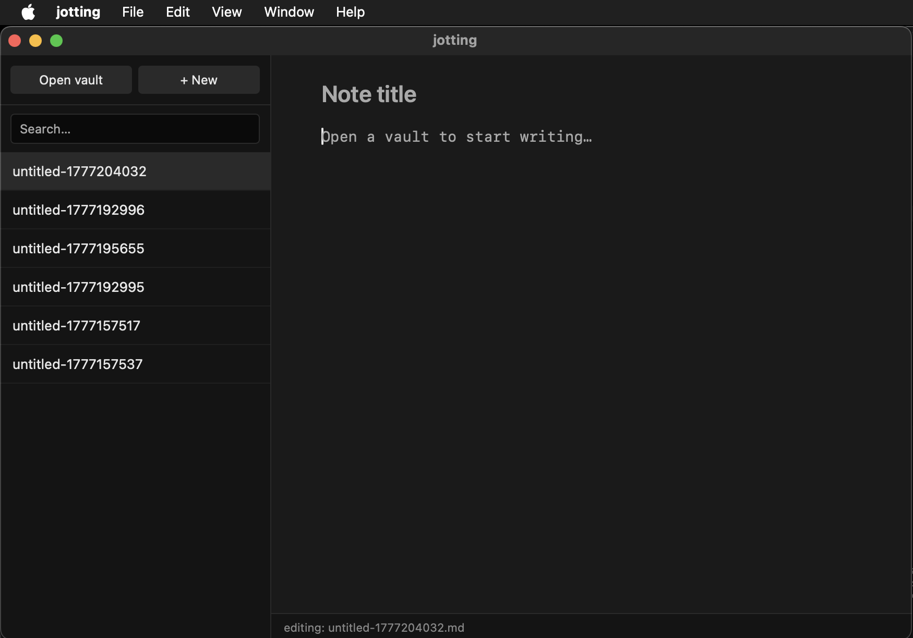

# Jotting

A fast notes app built with Tauri 2 (Rust + JavaScript) built from a personal need:
one place for all my notes across macOS, Windows, and Linux — fast, private, and without 
being locked into any single platform's ecosystem. Combining native-like performance, 
a clean minimalist UI, and sync via any cloud folder (Google Drive, OneDrive, Dropbox).



## Features

- **Native speed performance** — Tauri shell with Rust backend
- **Vault-based** — works on a plain folder of `.md` files
- **Auto-save** — saves 400ms after you stop typing
- **Live sync** — file system watcher (FSEvents on macOS) picks up external changes 
  instantly, so cloud drive sync feels real-time
- **Full-text search** — searches across all note contents

## Tech stack

- **Tauri 2** — Rust backend, native webview
- **Rust** — file I/O, file system watching via `notify` crate
- **Vanilla JS + Vite** — no framework overhead
- **Target platforms** — macOS, Windows, Linux

## Running locally

```bash
# Prerequisites: Rust, Node 20+, Xcode CLI tools (macOS)
npm install
npm run tauri dev
```

## Building

```bash
npm run tauri build
# Output: src-tauri/target/release/bundle/macos/jotting.app
```

## History

Started in September 2025 as a Python/PyQt6 notetaking app prototype. Wanted to
make a notes app with native speed performance and cross-platform functionality.

Rebuilt from scratch in April 2026 using Tauri 2. The switch made sense for two 
reasons: 1. Tauri's native webview approach produces a ~5MB bundle with 
near-native performance (vs PyQt6's much heavier footprint), and 2. The UI layer is 
plain HTML/CSS — something I was already comfortable with — rather than Qt's own 
widget system and learning curve.